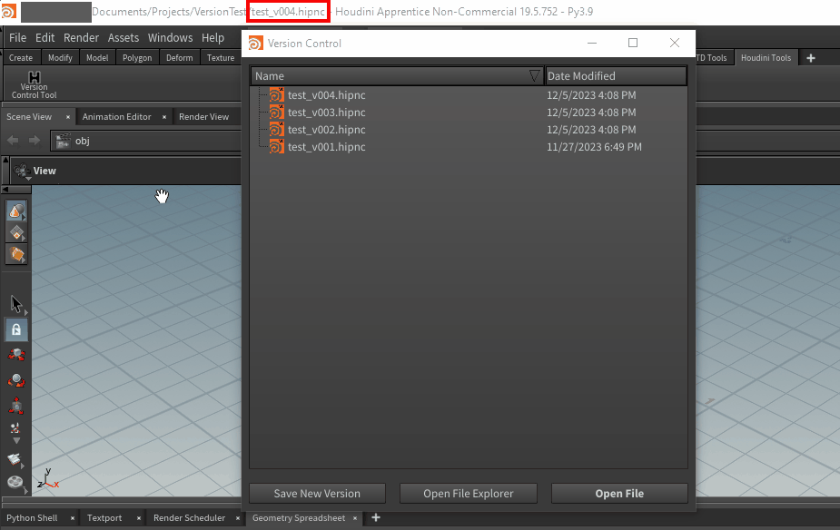
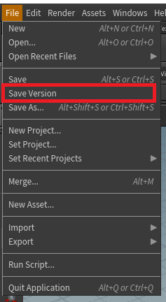
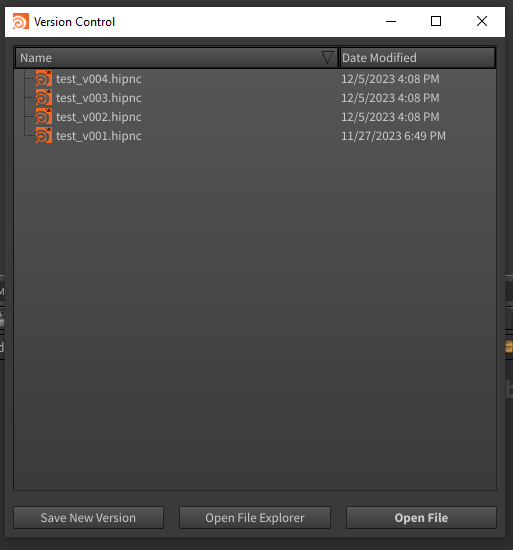

# Houdini Tools and Scripts

## Houdini Version Control Tool

The Houdini Version Control Tool allows a user to increment and save a Houdini file with a version suffix automatically. This can be done via the "File" main menu in the upper toolbar or through the shelf tool.

Features include:
* Auto-increment and save versions with _v### suffix (also works with _V### if that is existing format)
* Add default _v001 if file does not have version 
* User has option to overwrite or save as latest version if incremented version already exists
* Easily view a list of all versions of the current file via the shelf tool
* Seamlessly switch between versions by double-clicking to open desired version from the list
  


### Installation

1. Download the repo files and save anywhere. (Remember the path of where you saved)
    
    - You should delete the "img" folder which is only used for documentation
2. Find your user houdini files 
    
    - For Windows, it is usually in C:\Users\\[yourUser]\Documents\houdini19.5

3. Create an empty folder in the houdini folder called "packages" (all lowercase) if it does not already exist
4. Inside this new folder, create a new "packages.json" file
    - The json file should include the path where you saved the tool files, like this:  

   ```
    {
    "package_path": ["Insert path to tool files here"]
    }
    ```
    - You may use Houdini's included file paths depending on where you saved it. Ex: $HOME/Projects/HoudiniTools_KJ
6. Open your file in Houdini and add the new shelf tool
  

- The name of this shelf is written in the ```default.shelf``` file under label (NOT NAME) and can be changed at any time.  

  ```
  <toolshelf name="houdini_tools_kj" label="Houdini Tools">
  ```
- If changed, make sure to remove the old shelf and add the newly named one.

After installation, there should be a new shelf that contains the Version Control tool. In addition, the main menu should contain a new option "Save Version".  

### Main Menu - Save Version
The tool adds a new option to the "File" main menu in Houdini.  



A hotkey can be added to this action at any time through the Houdini hotkey settings (Edit -> Hotkeys). In the Hotkey Manager, either search "Save Version" or look under the Houdini Context for the action.

### Saving a new version
The tool requires the version format to be ```_v###```. It identifies this string in the current file, increments the number by 1, and saves the new version. The tool can work with either lowercase (_v###) or uppercase(_V###) but will default to lowercase if the version does not already exist.

If there is no version number in the current file, it will add a _v001 suffix to the file and save. 

The tool will still work if the version number is not at the end of the file name. 
Ex) If the filename = i_HDP_010_E10_v001.000029.hip, the tool will save i_HDP_010_E10_v002.000029.hip as the new version name.

### Saving an incremented version that already exists
When saving a new version, the tool always checks if that version already exists within the directory. If the tool detects the file already exists, it will prompt the user for 2 options:
1. Overwrite the incremented version
2. Make the new version the latest version in the list


### Version Control Shelf Tool
The newly added shelf contains the Version Control tool button.  


Clicking on the tool will open a window that displays a list of the all the versions associated with the current file (that are in the same directory). The list updates automatically when new versions are added, deleted, or updated. It displays the name of the files and the datetime the file has been last modified. It is also sortable by name and date modified.



The tool includes 3 actions:
1. Save a new version of the current file by clicking the corresponding button
2. Open Houdini's file manager to the directory that the current file is in by clicking on the "Open File Explorer" button
3. Open a file by using the "Open File" button within the window or by double-clicking on the desired file

## License
[MIT](https://choosealicense.com/licenses/mit/)
